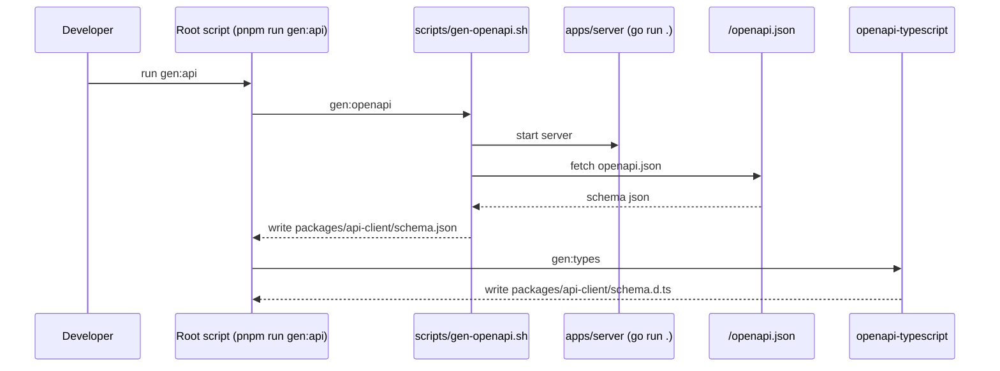

# expo-huma-monorepo-template

Expo (mobile) + Huma (Go API) + pnpm workspace + mise を使ったモノレポテンプレートです。  
OpenAPI スキーマを Go サーバーから取得し、TypeScript 型を自動生成して `mobile` から型安全に利用できます。

## 1. このテンプレでできること

- `apps/server`: Go + Huma API
- `packages/api-client`: OpenAPI から生成した型 + `createApiClient`
- `apps/mobile`: Expo アプリ（`client.GET` をシンプルに利用）
- ルートコマンドで OpenAPI -> TypeScript 型生成

## 2. 全体構成

```mermaid
flowchart LR
  M[apps/mobile<br/>Expo] -->|import| C[packages/api-client]
  C -->|GET /greeting/{name}| S[apps/server<br/>Go + Huma]
  S -->|/openapi.json| G[scripts/gen-openapi.sh]
  G -->|schema.json| C
  C -->|openapi-typescript| T[schema.d.ts]
```

## 3. ディレクトリ構成

```text
.
├── apps
│   ├── mobile
│   │   ├── App.tsx
│   │   ├── api/client.ts
│   │   ├── app.json
│   │   ├── styles.ts
│   │   ├── .env.example
│   │   └── package.json
│   └── server
│       ├── go.mod
│       └── main.go
├── packages
│   └── api-client
│       ├── index.ts
│       ├── schema.json
│       └── package.json
├── scripts
│   └── gen-openapi.sh
├── package.json
├── pnpm-workspace.yaml
└── mise.toml
```

## 4. セットアップ

### 前提

- `mise`
- `pnpm`
- `Go`
- `Node.js`

`mise` を使う場合:

```bash
mise install
eval "$(mise activate zsh)"
```

> `go` / `pnpm` が見つからない場合は、`mise activate` がシェルに反映されていない可能性があります。

依存インストール:

```bash
pnpm install
```

## 5. 開発フロー（最短）

### Step 1: API を起動

```bash
pnpm run dev:server
```

### Step 2: OpenAPI + 型生成（ルート）

```bash
pnpm run gen:api
```

このコマンドは以下を順番に実行します。

1. `scripts/gen-openapi.sh` で `http://127.0.0.1:8888/openapi.json` を取得
2. `packages/api-client/schema.json` を更新
3. `openapi-typescript` で `schema.d.ts` を生成

### Step 3: Mobile 起動

```bash
pnpm run dev:mobile
```

## 6. 主要コマンド

- `pnpm run gen:openapi`: Go API から OpenAPI JSON を取得
- `pnpm run gen:types`: `schema.json` から TS 型を生成
- `pnpm run gen:api`: 上2つを連続実行
- `pnpm run dev:server`: Go API 起動
- `pnpm run dev:mobile`: Expo 起動
- `pnpm run dev:android`: Android 起動
- `pnpm run dev:ios`: iOS 起動

## 7. OpenAPI 生成フロー詳細



## 8. Mobile からの利用例

```ts
import useSWR from "swr";
import { client } from "./api/client";

async function fetchGreeting(name: string) {
  const { data, error } = await client.GET("/greeting/{name}", {
    params: { path: { name } },
  });
  if (error || !data) throw new Error("Failed to fetch greeting");
  return data;
}

function useGreeting(name: string) {
  return useSWR(["greeting", name], ([, keyName]) => fetchGreeting(keyName));
}
```

`apps/mobile/.env` 例:

```bash
EXPO_PUBLIC_API_BASE_URL=http://192.168.1.10:8888
```

`apps/mobile/api/client.ts`:

```ts
import { createApiClient } from "api-client";

export const baseUrl =
  process.env.EXPO_PUBLIC_API_BASE_URL ?? "http://localhost:8888";
export const client = createApiClient(baseUrl);
```

## 9. よくあるハマりどころ

- Expo 実機で `localhost` に繋がらない
  - 実機の `localhost` は端末自身。API URL は開発 PC の IP にする
- `go` / `pnpm` が `command not found`
  - `mise install` + `mise activate` を確認

## 10. 今後の拡張候補

- Docker (`apps/server` 用 `Dockerfile`, ルート `compose.yml`)
- `apps/web` 追加
- `api-client` の認証ヘッダ/リトライ制御
